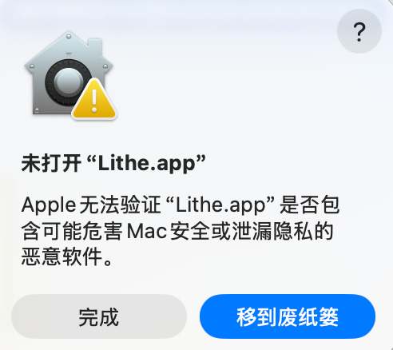
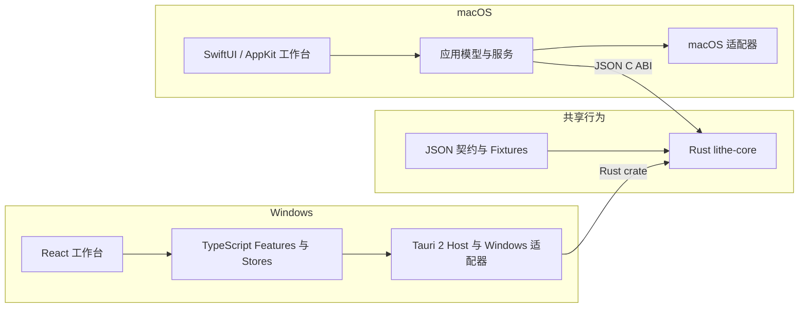

<div align="center">
  

  <h1>Lithe</h1>

  <p><strong>面向 Java 开发与 AI 协作的低内存占用 IntelliJ IDEA 替代品</strong></p>

  <p>
    <a href="./README.md"><strong>English</strong></a> ·
    <a href="#核心功能">核心功能</a> ·
    <a href="#产品截图">产品截图</a> ·
    <a href="#下载与安装">下载</a> ·
    <a href="#架构概览">架构图</a> ·
    <a href="#如何开发">如何开发</a>
  </p>

  <p>
    <a href="https://hellogithub.com/repository/1lck/Lithe-IDEA" target="_blank"></a>
  </p>

  <p>
    <a href="https://github.com/1lck/Lithe-IDEA/releases/latest"></a>
    <a href="https://github.com/1lck/Lithe-IDEA/releases"></a>
    
    
    
    <a href="#下载与安装"></a>
    <a href="./LICENSE"></a>
  </p>
</div>

## 欢迎加入群聊

欢迎加入 Lithe 社区，分享使用体验、交流问题，并获取项目最新动态。

<div align="center">
<table>
  <tr>
    <th>QQ群</th>
    <th>微信群</th>
  </tr>
  <tr>
    <td align="center"><a href="https://qm.qq.com/cgi-bin/qm/qr?k=&amp;group_code=163027877"></a></td>
    <td align="center"><a href="https://gcnctzuuwe9u.feishu.cn/wiki/HJFbwZ0hZirAPnkWF3xcPWkCnid?from=from_copylink"></a></td>
  </tr>
</table>
</div>

如果无法扫描微信群二维码，[点击这里通过飞书加入群聊](https://gcnctzuuwe9u.feishu.cn/wiki/HJFbwZ0hZirAPnkWF3xcPWkCnid?from=from_copylink)。

## 为什么做 Lithe

Codex、Claude Code 等 AI 编程工具已经可以承担大量编码工作，但开发者仍然需要 IDE 来理解生成的代码、跳转符号、运行调试项目并审查每一次修改。只为完成这些工作而常驻一套占用数 GB 内存的开发环境，显得越来越沉重。

## Lithe 是什么

Lithe 是一款主要面向 Java 和 Spring Boot 开发者的轻量级 IDEA 替代品，保留项目浏览、代码编辑与导航、搜索、Maven、运行调试、Git Diff、本地历史和数据库等核心工作流。

打开普通项目后，Lithe 应用本身的基础内存占用通常约为 **300～400 MB**。语言服务器、终端、构建工具、调试器和数据库组件均按需启动；实际占用会随项目和启用的服务变化。

> **AI 负责编写代码，Lithe 负责帮你看懂、跑通并审查修改。**

## macOS 提示“无法打开 Lithe.app”

如果 macOS 提示“Apple 无法验证 Lithe.app 是否包含可能危害 Mac 安全或泄漏隐私的恶意软件”，通常是因为手动下载的安装包尚未经过 Apple 公证。请先确认应用来自可信的 [GitHub Releases](https://github.com/1lck/Lithe-IDEA/releases/latest)，然后选择以下任一方式：

<p align="center">
  
</p>

1. 在“应用程序”中按住 Control 键点按 `Lithe.app`，选择“打开”，再在确认对话框中选择“打开”。
2. 如果仍被阻止，打开“系统设置 > 隐私与安全性”，在安全性提示旁点按“仍要打开”，然后再次启动应用。
3. 也可以在终端中移除下载文件的隔离标记：

   ```bash
   sudo xattr -dr com.apple.quarantine /Applications/Lithe.app
   ```

上述命令只应对你确认来源可靠的应用使用；通过 Homebrew 安装通常不需要手动执行这些步骤。

## 核心功能

<details>
<summary>展开核心功能</summary>

1. 适配 Spring Boot 项目体系，适合 Java 开发。
2. 支持 Maven 管理、断点调试和自定义启动配置。
3. 支持 Git 管理和 Diff 审查。
4. 支持双击 Shift 搜索，以及 `Command + Shift + F` 全局搜索。
5. 支持无需 LSP 的轻量补全和当前文件导航，并可按需使用语言服务器增强补全、悬浮与语义导航。
6. 支持本地快照保存。
7. 支持在应用内打开多个项目。
8. 支持在同一窗口打开多个文件，各文件相互独立。
9. 支持使用 AI 自动生成 Commit Message，并可自定义格式。
10. 支持多种 Markdown 语法渲染，与语雀一致。
11. 支持查看应用的本地内存占用情况。
12. 支持通过 Homebrew 一键安装和更新。
13. 支持在应用内一键更新并安装。
14. 自动识别 Spring Boot、Java、Maven、Gradle、npm、Cargo、Go、Python、Make、Docker Compose、Procfile 和 Shell 项目的可运行入口，并支持一键运行。
15. 支持按语言独立开关语言服务，可根据电脑配置自由启用或停用。
16. 支持类似 IDEA 的多行编辑器标签，同时展示更多打开的文件。
17. 新增数据库连接工作台，支持多种数据库类型、连接管理、SQL 历史、表浏览和数据库操作。
18. 持续修复问题并优化用户体验。

</details>

## 产品截图

<p align="center">
  
  
</p>

<p align="center">
  
</p>

<p align="center">
  
  
</p>

<p align="center">
  
</p>

<p align="center">
  
  
</p>

<p align="center">
  
  
</p>

<p align="center">
  
</p>

<p align="center">
  
  
</p>

<p align="center">
  
  
</p>

## 下载与安装

- **macOS 13+：**前往 [GitHub Releases](https://github.com/1lck/Lithe-IDEA/releases/latest) 下载 `.dmg`。M 系列芯片选择 `arm64`，Intel 芯片选择 `x86_64`。
- **Windows x64：**前往 [GitHub Releases](https://github.com/1lck/Lithe-IDEA/releases/latest) 下载 Windows `.exe` 安装包。

macOS 推荐使用 Homebrew 安装和更新：

```bash
brew tap 1lck/lithe https://github.com/1lck/Lithe-IDEA.git
brew install --cask 1lck/lithe/lithe
brew upgrade --cask lithe
```

## 架构概览

macOS 是当前参考产品，Windows 是独立的 React/Tauri 实现。两端通过 Rust Core 共享确定性命令与契约，同时保持原生界面和平台能力相互独立。



<details>
<summary><strong>如何开发</strong></summary>


开发环境需要 Swift 6.2 或更高版本。运行完整测试需要 Xcode；基础 SwiftPM 构建只需要 Command Line Tools。

在项目根目录运行开发版本：

```bash
./scripts/preview.sh
```

该脚本会构建并链接 Rust Core，然后启动 macOS 应用。只验证 Swift 源码时可以运行：

```bash
swift run --disable-sandbox Lithe
```

构建 App Bundle：

```bash
./scripts/package-app.sh
open dist/Lithe.app
```

提交改动前运行：

```bash
./scripts/test-macos.sh
./scripts/verify-core.sh
./scripts/verify-git-graph.sh
./scripts/verify-service-boundaries.sh
./scripts/verify-shared-contracts.sh
./scripts/verify-windows-boundaries.sh
./scripts/verify-rust-core.sh
```

目录归属、跨平台边界、共享规则以及 Rust Core 必须遵守的注释规范见[仓库目录与共享边界](./docs/architecture/repository-layout.md)。提交功能改动时，请说明验证方式和已知限制。

</details>

## 项目支持

### ❤️ 赞助商

<p align="center">
  <a href="https://www.fastaitoken.com/">
    
  </a>
</p>
<p align="center">
  <a href="https://www.fastaitoken.com/"><strong>FastAI</strong></a><br>
  FastAI 提供多款主流大模型的便捷中转服务，让开发者可以更轻松地把 AI 能力接入日常开发流程。其支持也帮助 Lithe 持续完善 AI 辅助体验。感谢 FastAI 对本项目的支持！欢迎扫码加入 FastAI Token 交流群②（群号：1073874006）。
</p>

<a href="mailto:2188718831@qq.com">想显示在下方？</a>

<table>
  <tr>
    <td width="112" align="center">
      <a href="https://www.fastaitoken.com/">
        
      </a>
    </td>
    <td>
      <a href="https://www.fastaitoken.com/"><strong>FastAI</strong></a> 提供多款主流大模型的便捷中转服务，让开发者可以更轻松地把 AI 能力接入日常开发流程。其支持也帮助 Lithe 持续完善 AI 辅助体验。感谢 FastAI 对本项目的支持！
    </td>
  </tr>
  <tr>
    <td width="112" align="center">
      <a href="https://torchai.ai/sign-up?aff=FdkE">
        
      </a>
    </td>
    <td>
      <a href="https://torchai.ai/sign-up?aff=FdkE"><strong>TorchAI</strong></a> 面向开发者提供大模型中转服务，便于在编程、内容生成和自动化等不同场景中调用模型 API。其支持帮助 Lithe 保持持续开发，并探索更实用的 AI 工具体验。感谢 TorchAI 对本项目的支持！
    </td>
  </tr>
  <tr>
    <td width="112" align="center">
      <a href="https://api.axis.fan/register?aff=4EZFN7322WTH">
        
      </a>
    </td>
    <td>
      <a href="https://api.axis.fan/register?aff=4EZFN7322WTH"><strong>元流 Token</strong></a> 提供多种大语言模型 API 的中转接入，为开发者体验不同模型、构建 AI 应用提供灵活入口。其赞助支持 Lithe 持续拓展并优化 AI 相关功能。感谢元流 Token 对本项目的支持！
    </td>
  </tr>
  <tr>
    <td width="112" align="center">
      <a href="https://codezsy.com/register?aff=fDyA">
        
      </a>
    </td>
    <td>
      <a href="https://codezsy.com/register?aff=fDyA"><strong>CodeZ</strong></a> 专注于 GPT 系列模型的稳定中转，为开发者在工具和项目中集成模型 API 提供简单直接的选择。其赞助为 Lithe 的持续开发与维护提供了助力。感谢 CodeZ 对本项目的支持！
    </td>
  </tr>
</table>

### ⭐ 特别鸣谢

<p align="center">
  <a href="https://linux.do/">
    
  </a>
</p>

<p align="center">
  <strong>关于 AI 的一切，欢迎前往 <a href="https://linux.do/">LINUX DO</a>！祝社区越来越好～</strong>
</p>

### 贡献者

感谢所有参与 Lithe 开发和改进的贡献者。

<a href="https://github.com/1lck/Lithe-IDEA/graphs/contributors">
  
</a>

### License

Lithe 采用 [Apache License 2.0](./LICENSE) 授权。

## Star History

<a href="https://www.star-history.com/#1lck/Lithe-IDEA&Date">
  
</a>
